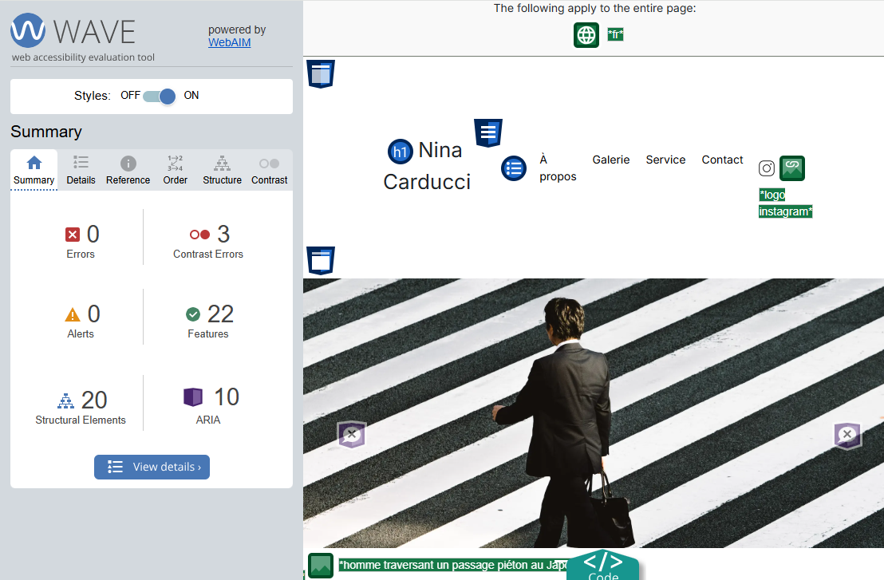

- J'ai réglé le problème de la gallerie qui défile, dans prevImage() et nextImage()
- J'ai régler le probleme du menu de la gallery dans le Bootstrap CSS

\*\*\*\*\*\* Amélioration en suivant LightHouse

\*\* Amelioration Performance

- définir une taille fixe des photos dans class="carousel-inner";
- déplacer le script en bas du body (+1 score performance)
- Redimension de toutes les photos

         SCORE PERFORMANCE -> 95

\*\* Amélioration SEO

- donner des alt à toute les images
- ajout des balises header, nav, main, article, section et footer,
- Meilleur choix des titres (un seul h1, h2 pour les titres de section etc.. )

- Ajout du Title dans Head (avec l'emplacement, Bordeaux)
- Ajout de la meta - description dans Head

         SCORE SEO -> 100

\*\*Réfenrencement local et réseaux sociaux

- Ajout de la balise Meta - description et Meta - robots dans le Head

- Ajoute des Meta dans le Head Open Graph et Twitter Card

- AJout de la balise script dans le HTML de schema.org/localbusiness, avec la localisation et les heure d'ouverture et test du code dans Google Rich Snippet -> Aucun problème

\*\* Amélioration Accessibilité

- Ajout de lang="fr" dans la balise <html>

- Ajout des for="" pour les labels des inputs et textarea

         SCORE ACCESSIBILITY -> 96

---
